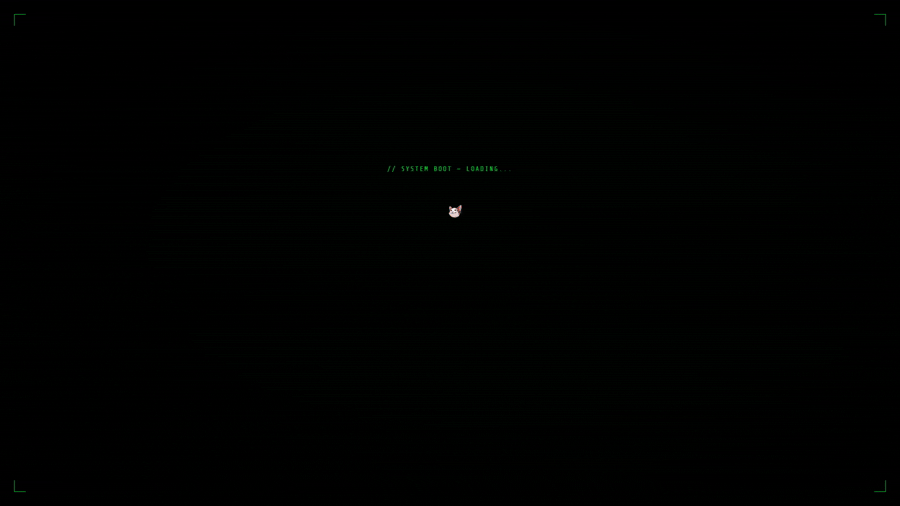
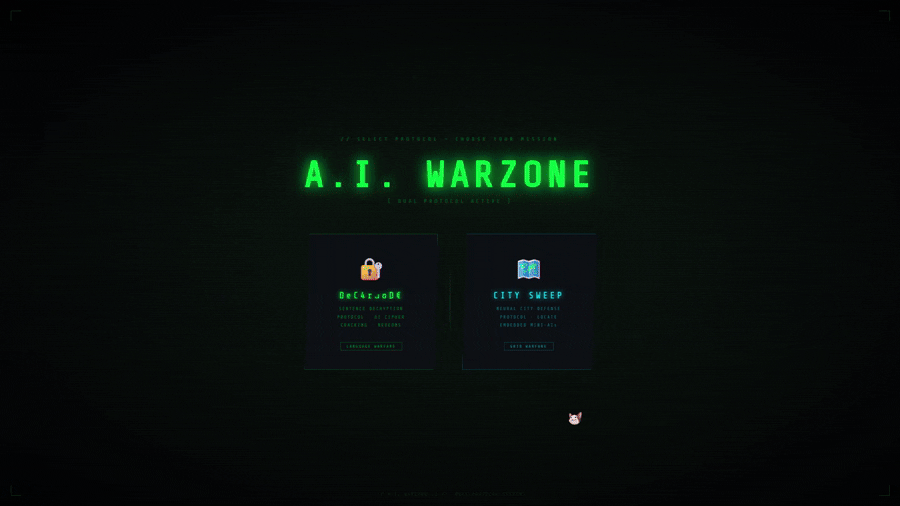

# 🤖 AI WARZONE

### RAG-Powered Knowledge Game & GAN/VAE Cybersecurity Simulator

> A web-based AI gaming platform demonstrating Retrieval-Augmented Generation (RAG), Generative Adversarial Networks (GANs), Variational Autoencoders (VAEs), Procedural Content Generation, and Anomaly Detection — all implemented locally in Python without relying on external AI APIs.

---

# 🎮 Overview

AI WARZONE combines multiple Artificial Intelligence and Machine Learning concepts into interactive game experiences.

Instead of simply integrating external AI services, the project implements several AI systems directly in Python, including:

* Retrieval-Augmented Generation (RAG)
* Knowledge Engineering
* Semantic Search
* Progressive Hint Generation
* Generative Adversarial Networks (GANs)
* Variational Autoencoders (VAEs)
* Procedural Content Generation
* Anomaly Detection

The platform contains two independent AI-powered games running under a unified Flask backend.

---

# 🕹️ Games

## 🔹 DeCorroDE

A sentence reconstruction and knowledge reasoning game powered by a custom Retrieval-Augmented Generation pipeline.

Players decode corrupted sentences using contextual hints, semantic reasoning, and AI-assisted retrieval mechanisms.

### Core Concepts

* Retrieval-Augmented Generation
* Knowledge Representation
* Semantic Search
* Context-Aware Hinting
* Conversational AI
* Information Retrieval

---

## 🔹 City Sweep

A cybersecurity-inspired strategy game where players identify hidden AI infiltrators within a procedurally generated digital city.

Deep learning models are used to generate environments and detect anomalies across the network.

### Core Concepts

* Procedural Content Generation
* Generative Adversarial Networks
* Variational Autoencoders
* Anomaly Detection
* Network Security Simulation

---

# 📸 Screenshots

## Main Hub

---

## DeCorroDE Game

---

## City Sweep Game

---

# 🧠 Artificial Intelligence Components

## Retrieval-Augmented Generation (RAG)

The DeCorroDE game uses a custom retrieval pipeline built around a structured knowledge base.

Instead of querying external language models, relevant information is retrieved from curated datasets and transformed into contextual assistance.

### Features

* Topic retrieval
* Semantic matching
* Category classification
* Definition lookup
* Synonym extraction
* Knowledge-grounded responses

---

## Knowledge Engineering

The project includes a structured knowledge base containing multiple domains.

### Domains

* Philosophy
* Science
* History
* Geography
* Literature
* Psychology
* Culture
* Motivation
* General Knowledge

Each entry contains semantic metadata such as:

* Topics
* Categories
* Keywords
* Definitions
* Synonyms
* Contextual explanations

---

## Progressive Hint Generation

Hints are generated dynamically based on retrieved knowledge.

### Hint Levels

| Level | Information Provided            |
| ----- | ------------------------------- |
| 1     | Topic & category clues          |
| 2     | Synonym-based hints             |
| 3     | Structural reconstruction clues |

This allows players to receive assistance while preserving challenge and engagement.

---

## Retrieval-Based Chatbot

A custom chatbot provides contextual support during gameplay.

### Features

* Retrieval-based responses
* Semantic similarity matching
* Knowledge-grounded explanations
* Anti-answer leakage protection
* Controlled information disclosure

---

# 🏙️ City Sweep AI Systems

## Generative Adversarial Network (GAN)

A GAN was implemented from scratch using PyTorch.

### Generator

Creates synthetic city layouts from latent noise vectors.

### Discriminator

Distinguishes generated city layouts from real layouts.

### Applications

* Procedural city generation
* Dynamic environment creation
* AI placement simulation
* Replayability enhancement

---

## Variational Autoencoder (VAE)

A Variational Autoencoder was implemented from scratch for anomaly detection.

### Purpose

Learn normal node behaviour and identify suspicious activity through reconstruction error.

### Features Analysed

* Traffic Flow
* Latency
* Packet Loss
* CPU Load
* Memory Usage
* Connection Count
* Error Rate
* Uptime

Nodes exhibiting abnormal behaviour are flagged as potential AI infiltrators.

---

# 🔬 Machine Learning Components

| System         | Purpose                     |
| -------------- | --------------------------- |
| RAG Engine     | Knowledge retrieval         |
| Knowledge Base | Semantic reasoning          |
| Hint Generator | Progressive clue generation |
| Chatbot        | Contextual assistance       |
| GAN            | Procedural city generation  |
| VAE            | Anomaly detection           |
| PyTorch Models | AI inference                |
| Flask Backend  | Game orchestration          |

---

# ⚙️ System Architecture

```text
                    ┌─────────────────┐
                    │   Flask Server  │
                    └────────┬────────┘
                             │
        ┌────────────────────┼────────────────────┐
        │                                         │
        ▼                                         ▼

 ┌───────────────┐                    ┌─────────────────┐
 │   DeCorroDE   │                    │   City Sweep    │
 └───────┬───────┘                    └────────┬────────┘
         │                                     │

         ▼                                     ▼

 ┌───────────────┐                    ┌─────────────────┐
 │  RAG Engine   │                    │       GAN       │
 └───────┬───────┘                    └────────┬────────┘
         │                                     │

         ▼                                     ▼

 ┌───────────────┐                    ┌─────────────────┐
 │ Knowledge Base│                    │       VAE       │
 └───────────────┘                    └─────────────────┘
```

---

# 🛠️ Technology Stack

### Backend

* Python
* Flask

### Machine Learning

* PyTorch
* NumPy

### Frontend

* HTML5
* CSS3
* JavaScript

### Data Storage

* JSON
* JSONL

---

# 📂 Project Structure

```text
AI_WARZONE/
│
├── data/
│   ├── hints.jsonl
│   ├── nexeons.json
│   ├── rag_knowledge_base.json
│   ├── sentences.json
│   └── numpy_gan_weights.pkl
│
├── models/
│   ├── gan_weights.pt
│   └── vae_weights.pt
│
├── training_files/
│   ├── game1/
│   │   ├── build_rag_kb.py
│   │   └── Numpy_train_gan.py
│   │
│   └── game2/
│       └── train_all.py
│
├── chatbot.py
├── gan.py
├── hint_generator.py
├── server.py
├── vae.py
├── word_dictionary.py
│
├── index.html
├── index1.html
├── index2.html
│
├── requirements.txt
└── .gitignore
```

---

# 🚀 Running the Project

```bash
git clone https://github.com/Ra-Helios/AI_WARZONE.git

cd AI_WARZONE

pip install -r requirements.txt

python server.py
```

Open:

```text
http://localhost:5000
```

---

# 🎯 Educational Value

This project demonstrates practical applications of:

* Retrieval-Augmented Generation (RAG)
* Knowledge Representation
* Information Retrieval
* Deep Learning
* Generative Adversarial Networks (GANs)
* Variational Autoencoders (VAEs)
* Procedural Content Generation
* Anomaly Detection
* Flask Web Development
* AI Game Design

AI WARZONE serves as both an interactive gaming platform and a demonstration of how modern AI concepts can be transformed into engaging software systems.
